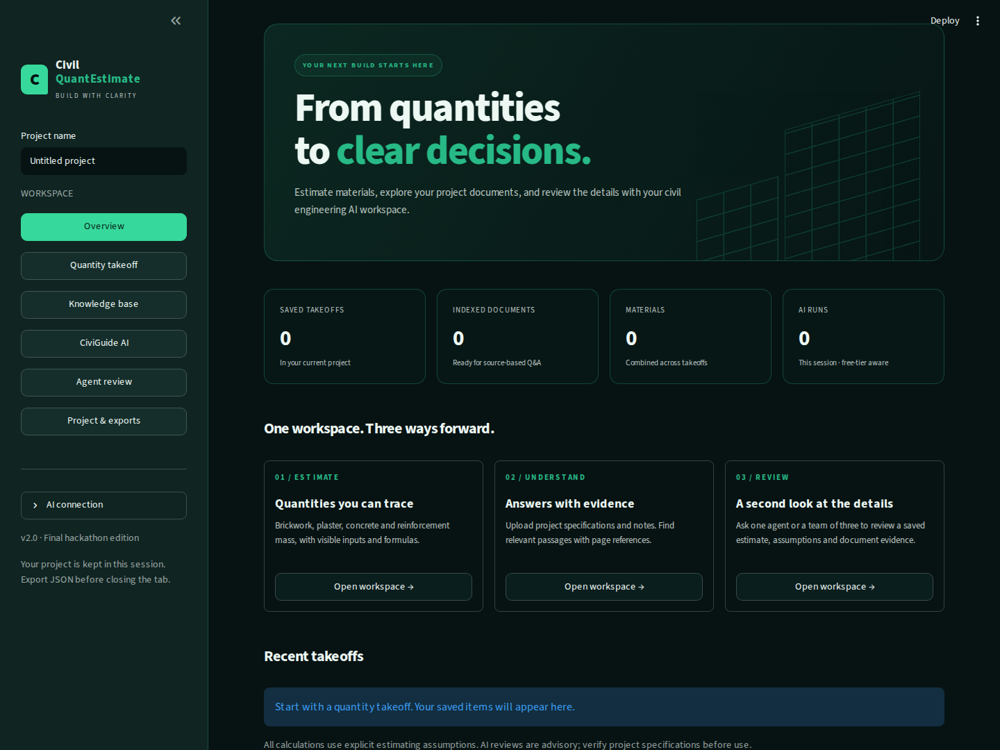

# Civil QuantEstimate v2

**Build smarter. Estimate faster.** A Python 3.11 / Streamlit final-hackathon project with quantity takeoff, document RAG, and CrewAI reviews.

Start with [START_HERE.md](START_HERE.md) for Windows, GitHub and Streamlit deployment instructions.



## What is included

| Feature | What actually runs |
| --- | --- |
| Four calculators | Python formulas for brickwork, plaster, nominal concrete materials and reinforcement bar mass |
| Project schedule | Multiple saved items, material aggregation, user-entered rates and explicit unpriced items |
| Document RAG | Text extraction -> token-aware chunks -> sentence-transformer embeddings -> FAISS similarity search -> Groq answer with source references |
| CiviGuide | Document-only Q&A or general civil guidance with the latest calculation |
| Single-agent review | One CrewAI agent with document-search and recalculation tools |
| Three-agent review | Document analyst, quantity reviewer and report writer in a sequential Crew |
| AI workflow | A CrewAI Flow coordinates validation, retrieval, review and report packaging |
| Exports | Project JSON, material CSV and PDF report; JSON imports recalculate results |
| Interface | Green theme, responsive pages, native Streamlit theme support |

The original uploaded `app (2).py` and `style (2).css` informed the branding and four-module scope. Their imported `utils/calculations.py`, `utils/data.py` and `utils/groq_helper.py` were **not supplied**. The v2 calculation engine is a new implementation with visible assumptions. It is not a verified copy of the old formulas. Keep your old project; compare its utility files before migrating real project data.

## Run locally

Use Python **3.11**. In the project folder:

```bash
python -m venv .venv
# Windows Command Prompt:
.venv\Scripts\activate
# macOS/Linux instead:
# source .venv/bin/activate
python -m pip install --upgrade pip
python -m pip install -r requirements.txt
python -m streamlit run app.py
```

For AI, create `.streamlit/secrets.toml` from the included example:

```toml
GROQ_API_KEY = "your-key"
GROQ_MODEL = "openai/gpt-oss-120b"
```

Alternatively, enter a personal key under **AI connection** in the sidebar. Calculations, costing and exports work without a key. Document indexing and search also do not require a Groq key; the public embedding model downloads on first use.

## Stack and free usage

- Python 3.11; Streamlit Community Cloud deployment target.
- CrewAI with its LiteLLM extra, explicitly configured as `groq/openai/gpt-oss-120b`. Direct Groq SDK calls use `openai/gpt-oss-120b`.
- Optional smaller model: `openai/gpt-oss-20b`, subject to your Groq account's availability.
- Sentence Transformers model: `sentence-transformers/all-MiniLM-L6-v2`, running on CPU.
- FAISS `IndexFlatIP` over normalized embeddings. Cosine similarity is a retrieval score, not a probability of correctness.
- `pypdf` for text PDFs; ReportLab plus bundled DejaVu fonts for PDF exports.
- No paid vector database, web-search subscription or embedding API. No OpenAI API key is used.

Groq's free tier is quota-limited. Multi-agent reviews make several LLM calls, so single-agent mode is the default. Exact limits depend on your organization and can change. A smaller model does not necessarily have higher limits. Use a free Groq account; if you supply a billable account key, this application cannot prevent the provider from charging that account. Hosting and package availability are controlled by their providers.

## Try the demo

1. Open **Knowledge base** -> **Use demo specification**.
2. Search `What plaster thickness is required?` without an API call.
3. Ask the same question in **CiviGuide AI**, in **Documents only** mode.
4. Open **Quantity takeoff**, select **Plaster**, and save the default 12 mm takeoff.
5. Open **Agent review**, choose that takeoff and ask: `Compare my plaster thickness with the specification and identify any mismatch.`
6. Start with **Single agent**. The fictional specification states **15 mm**; the input is **12 mm**. Inspect the retrieved passages and the review. Do not assume the model will catch every discrepancy.
7. Run **Three agents** after checking free-tier quota. Inspect individual outputs and actual tool events.
8. Enter your own rates in **Project & exports**, then download JSON, CSV and PDF.

The demo specification is clearly labelled fictional. It is not a building standard. A sample project JSON is also included under `samples/`.

## Project files

| File / directory | Purpose |
| --- | --- |
| `app.py`, `style.css` | Streamlit pages and theme |
| `core/calculations.py` | Validated SI-unit formulas and material aggregation |
| `core/project.py` | JSON restore, material schedule and CSV export |
| `core/reports.py` | PDF report |
| `ai/rag.py` | Bounded document ingestion, chunking and FAISS retrieval |
| `ai/providers.py` | Groq chat and CrewAI model configuration |
| `ai/workflow.py` | Real CrewAI tools, agents, Crew and Flow |
| `requirements.txt`, `constraints.txt` | Direct requirements and resolved dependency constraints |
| `.streamlit/` | Theme settings and a secrets example |
| `tests/` | Calculation, RAG, workflow and interface checks |
| `scripts/check_live_ai.py` | Optional verification using your own Groq key |
| `docs/` | Architecture, formulas, validation and limitations |
| `assets/fonts/` | PDF fonts and their licence |

## Verification

```bash
python -m pip check
python -m unittest discover -s tests -v
```

The tests use scripted responses for the LLM. They do **not** prove that the live Groq endpoint or your free quota will work. See [docs/VALIDATION.md](docs/VALIDATION.md) for the exact checks and remaining gaps.

After configuring your key, run:

```bash
python scripts/check_live_ai.py
```

This makes real Groq requests against your account and checks a single-agent review.

## Data and limitations

- Projects, messages and document indexes are per-session. They are not a durable user database. A tab reconnect or app restart can lose them. Export JSON before leaving.
- Replacing the document index clears related AI answers. JSON exports do not include uploaded documents, vector indexes, chat or API keys.
- Selected passages and estimate data go to Groq when you run AI. Embeddings run on the app server, not in the visitor's browser.
- Source-ID validation rejects unknown references; valid references can still be misinterpreted by a model. Read the evidence.
- A civil-only system instruction is a scope control, not a guarantee against every off-topic or prompt-injection attempt.
- PDFs must contain extractable text. There is no OCR, CAD/BIM extraction, drawing interpretation or automatic full BBS generation.
- Nominal mix quantities do not establish concrete strength or code compliance. Prices are entered by the user; labour, transport, taxes and overheads are not calculated.
- The current release is a tested hackathon foundation. Live API testing, cloud deployment, broader RAG evaluation and engineering review remain necessary before a commercial launch.

## Primary documentation

Checked during this build on 3 October 2026:

- [CrewAI installation and Python requirements](https://docs.crewai.com/en/installation)
- [CrewAI LLM providers](https://docs.crewai.com/en/concepts/llms)
- [CrewAI Flows](https://docs.crewai.com/en/concepts/flows)
- [Groq supported models](https://console.groq.com/docs/models)
- [Groq rate limits](https://console.groq.com/docs/rate-limits)
- [Sentence Transformers installation](https://sbert.net/docs/installation.html)
- [MiniLM model card](https://huggingface.co/sentence-transformers/all-MiniLM-L6-v2)
- [FAISS getting started](https://github.com/facebookresearch/faiss/wiki/Getting-started)
- [Streamlit dependencies](https://docs.streamlit.io/deploy/streamlit-community-cloud/deploy-your-app/app-dependencies)
- [Streamlit deployment](https://docs.streamlit.io/deploy/streamlit-community-cloud/deploy-your-app/deploy)
- [Creating a GitHub repository](https://docs.github.com/en/repositories/creating-and-managing-repositories/creating-a-new-repository)
